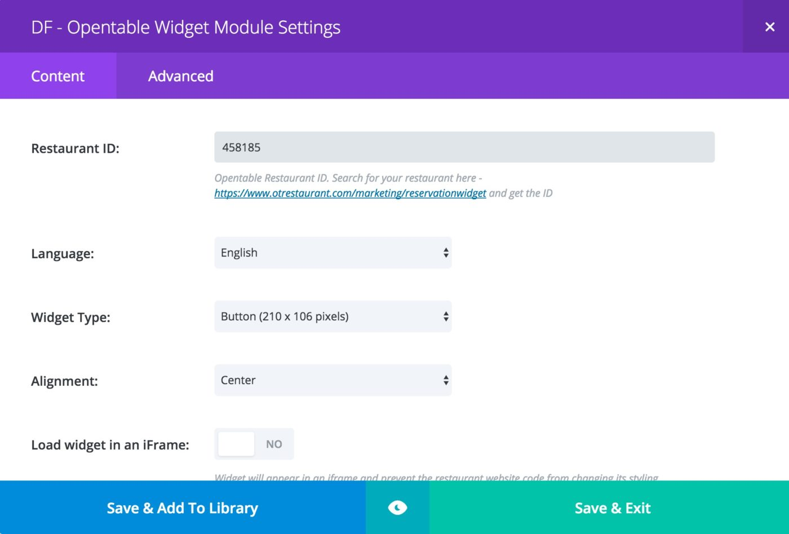

# OpenTable Divi Module - [www.diviframework.com](https://www.diviframework.com/)

This WordPress plugin allows your customers to make reservations directly on your website using [OpenTable’s reservation widget](https://www.opentable.com/start/home).

## Features

* An OpenTable Divi Module to add reservation widget to your page
* Divi module incorporates features to customise the reservation widget.
* Includes 4 layout options; Standard, Tall, Wide and Button styles so you can fit the tool into your design.
* Ability to choose a language.
* Ability to change the alignment
* Divi frontend builder support

## OpenTable Divi Module

OpenTable Reservation Divi Module, renders the reservation widget on a divi builder page.

The module has the following options.

**RESTAURANT ID**

Enter your Open table restaurant ID in this text option. Visit https://www.otrestaurant.com/marketing/reservationwidget, search for your restaurant and press ‘Next’. The restaurant id will be just below the restaurant title on the newly opened page.

**LANGUAGE**

This option select the language for the reservation widget. Options are English, Français, Español, Deutsch, Nederlands and 日本語’. Default is English

**WIDGET TYPE**

This option determines the UI type of rendered widget. Available options are Standard (224 x 289 pixels), Tall (280 x 477 pixels), Wide (832 x 154 pixels) and Button (210 x 106 pixels). Default is Standard (224 x 289 pixels)

**ALIGNMENT**

This option determines the alignment of the widget. Available options are left, right and center. Default is center.

**LOAD WIDGET IN AN IFRAME**

This toggle switch when switched on, will load the widget in an iframe. When switched off, it will load the widget as standard html. Default option is to load the widget on an iframe.

